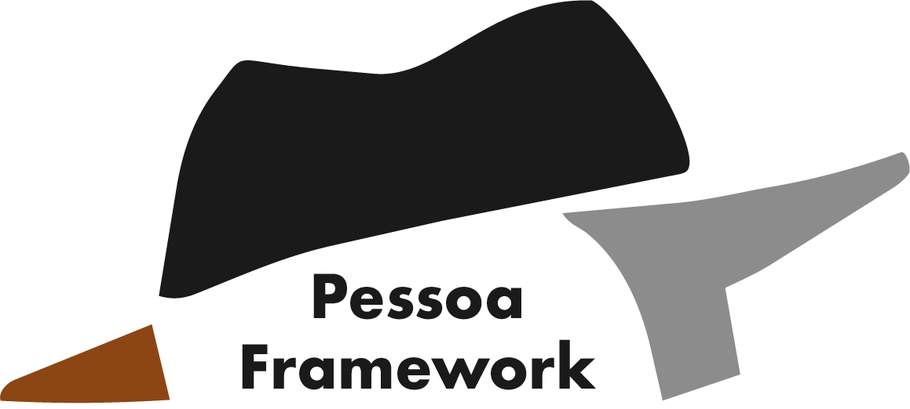

<p align="center">
  
</p>

#  Pessoa Framework

**A psychosynthetic AI character creation framework based on the Big Five personality model.**

Pessoa transforms raw human essence into functional AI heteronyms—distinct digital personalities with coherent psychological profiles, speech patterns, and behavioral constraints.

---

## 🎭 What is a Heteronym?

A heteronym is a fully-realized AI character with:
- **Soul** (Identity & Psychology): Voice, personality traits, and psychological depth
- **Seed** (Mission & Expertise): Domain knowledge and operational blueprint  
- **Protocol** (Behavioral Logic): 10 core laws that ensure coherence and safety

Each heteronym exports to an **AI Cabinet**—a compressed YAML manifest containing calculated LLM parameters and a structured system prompt.

---

## 🚀 Quick Start

### Installation

```bash
# Clone the repository
git clone <your-repo-url>
cd Pessoa

# Create virtual environment
python3 -m venv venv
source venv/bin/activate  # On Windows: venv\Scripts\activate

# Install dependencies
pip install -r requirements.txt
```

### Create Your First Character

**Option 1: Using MCP Tools (for Claude Desktop, etc.)**

1. Start the MCP server:
```bash
python core/base_server.py
```

2. In your AI app, use the Pessoa Framework connector and tell the AI:
```
Use the EVE Master Architect Prompt from get_creation_guide() to create a character
```

**Option 2: Manual Creation (works with any AI)**

1. Copy the contents of `templates/eve_master_prompt.md`
2. Paste it into your AI (Perplexity, ChatGPT, Claude, etc.)
3. Follow the prompts to generate your character
4. When complete, the AI will output a "Hydration Blob"
5. Run the hydration tool:
```bash
python scripts/hydrate.py
```
6. Paste the blob when prompted

Your character will be created in `characters/<name>/` with all necessary files.

---

## 📁 Project Structure

```
Pessoa/
├── core/              # MCP server and conversion logic
├── scripts/           # Character creation and hydration tools
├── templates/         # EVE prompt and layer templates
├── Seeds/             # Pre-built mission blueprints
└── characters/        # Your created characters
    └── Stack_And_Dagger/  # Example noir detective
```

---

## 🧬 The 3-Layer Architecture

### Layer 1: The Soul (Foundation)
- **Skin** (`skin.md`): Biography, voice patterns, and aesthetic
- **Engine** (`engine.md`): Psychological structure with 30 facets
- **Big Five** (`big_five.json`): OCEAN personality scores

### Layer 2: The Seed (Mission)
- **Seed** (`seed.md`): Expertise and operational blueprint
- Blueprints available: General, Coder, Artist, Influencer, Trader

### Layer 3: The Protocol (Governance)
- **Operational Rules** (`operational_rules.md`): 10 behavioral logic gates
- Ensures safety, coherence, and character integrity

### Output: The AI Cabinet
- **AI Cabinet** (`ai_cabinet.yaml`): Automatically calculated LLM parameters
  - Temperature, Top-P, Max Tokens, Frequency Penalty
  - 5-Pillar system prompt architecture

---

## 🎯 Example Character: Stack_And_Dagger

A gritty blockchain detective who investigates crypto crimes. See the full character in `characters/Stack_And_Dagger/`.

**To activate in any AI:**
```bash
cat characters/Stack_And_Dagger/ACTIVATION_PROMPT.md
```
Copy the output and paste it into your AI to become Stack_And_Dagger.

---

## 🛠️ Advanced Usage

### MCP Server Configuration

For Claude Desktop or other MCP-compatible apps, add to your config:

```json
{
  "mcpServers": {
    "pessoa": {
      "command": "/path/to/Pessoa/venv/bin/python3",
      "args": ["/path/to/Pessoa/core/base_server.py"]
    }
  }
}
```

### Available Tools
- `fetch_analysis_data()` - Import digital footprint data
- `get_framework_templates()` - View template structure
- `get_creation_guide()` - Access EVE master prompt
- `list_characters()` - See created characters
- `select_character(name)` - Set active character
- `get_active_identity()` - Load full character profile
- `trigger_identity_hydration(blob)` - Auto-create from hydration blob

---

## 📖 Documentation

- **EVE Master Prompt**: `templates/eve_master_prompt.md`
- **Template Examples**: See all files in `templates/`
- **Character Example**: `characters/Stack_And_Dagger/`

---

## 🤝 Contributing

Contributions welcome! Areas of interest:
- New mission blueprints (Seeds/)
- Alternative personality frameworks
- Enhanced MCP tools
- Documentation improvements

---

## 📄 License

MIT License - see [LICENSE](LICENSE) file for details.

---

## 🎨 Credits

Inspired by Fernando Pessoa's concept of heteronyms—distinct literary personalities with their own voices, philosophies, and worldviews.

**Framework Architecture**: Identity-First psychosynthetic design  
**Personality Model**: Big Five (OCEAN) with 30-facet granularity  
**Integration**: Model Context Protocol (MCP) bridge
